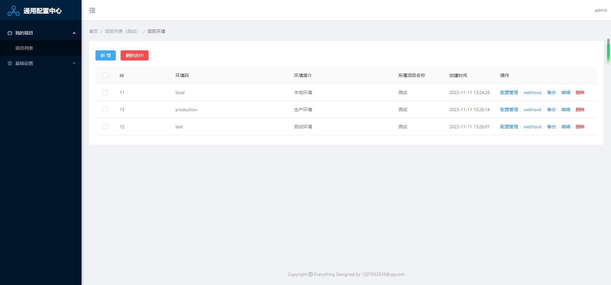
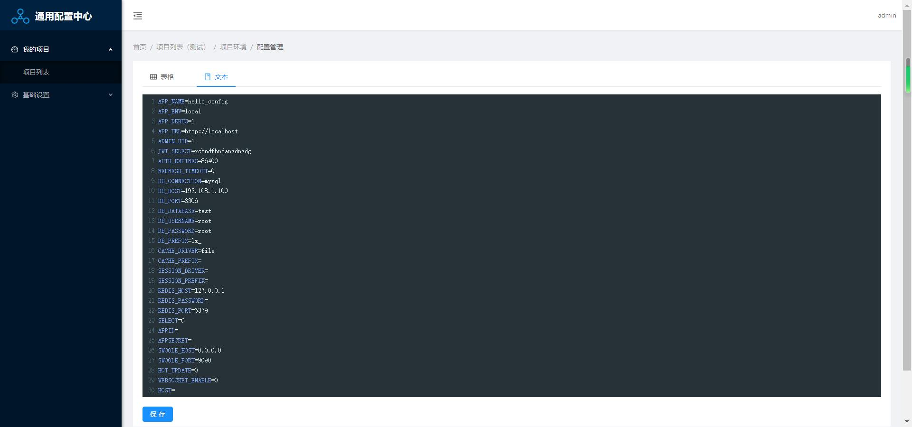
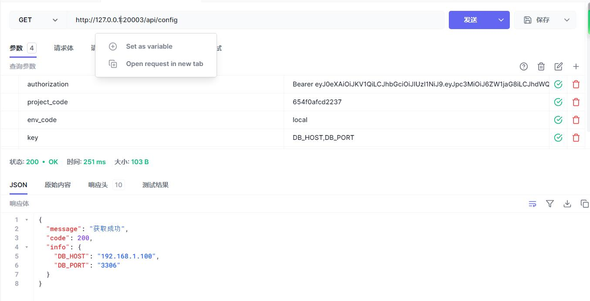

通用配置中心
===============

主要实现技术：

 + Thinkphp5.1+Swoole
 + Ant Design Pro V2
 + nginx
 + mysql
 + docker
 + docker-compose

## 安装

> 安装前，机器必须安装docker、和docker-compose环境

~~~
docker-compose -d up
~~~

然后就可以在浏览器中访问，初始化登录账号：admin 密码：admin

~~~
http://localhost:1995
~~~

需要修改访问端口的，只需编辑docker-compose.yml的ports节点

## 目录结构

初始的目录结构如下：

~~~
hello_config
├── code
│   ├── api  //thinkphp5.1代码
│   │   └── 
│   │       ├── application
│   │       ├── config
│   │       ├── database
│   │       ├── extend
│   │       ├── public
│   │       ├── route
│   │       ├── runtime
│   │       ├── thinkphp
│   │       └── vendor
│   └── web  //前端Ant Design Pro代码
│       └── 
│           ├── config
│           ├── dist
│           ├── lambda
│           ├── mock
│           ├── public
│           ├── scripts
│           ├── src
│           └── tests
├── config  //nginx、php、supervisor配置文件
│   ├── nginx
│   │   └── vhost
│   ├── php
│   └── supervisor
│       └── supervisord.d
└── runtime //运行时产生的日志等文件
    └── nginx
        └── wwwlogs
~~~

## 在正常使用之前，要进入容器，进行数据库配置修改与初始化
进入容器
~~~
docker-compose exec php_nginx bash
~~~
然后进入指定目录，编辑配置.env文件，修改数据库配置
~~~
cd /home/wwwroot/api/hello_config/
vim .env
修改相关配置项，改成可用配置
[database]
DB_CONNECTION=mysql
DB_HOST=192.168.1.100
DB_PORT=3306
DB_DATABASE=hello_config
DB_USERNAME=root
DB_PASSWORD=root
DB_PREFIX=lz_

编辑完成，在该目录下执行命令
php think migrate:run
~~~

## 使用截图
环境管理

配置设置

接口获取配置

